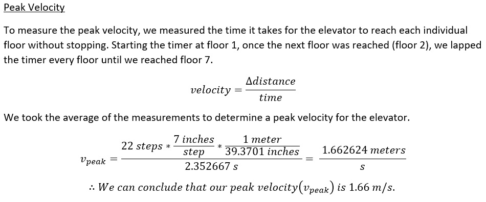
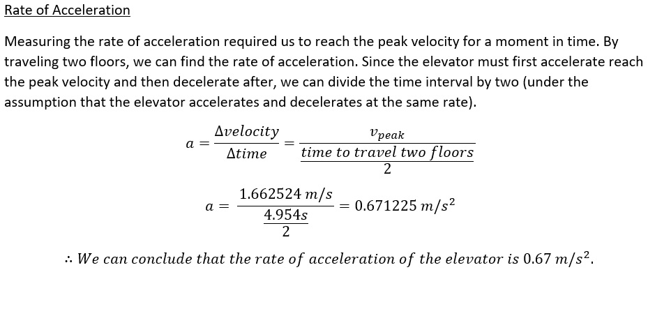
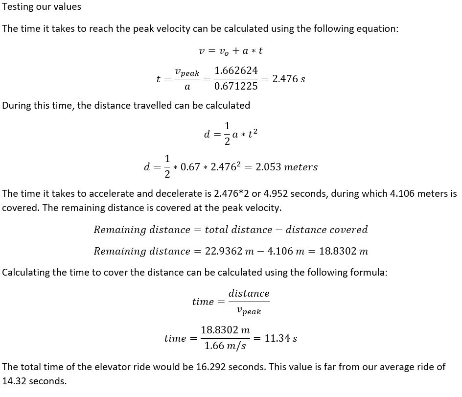
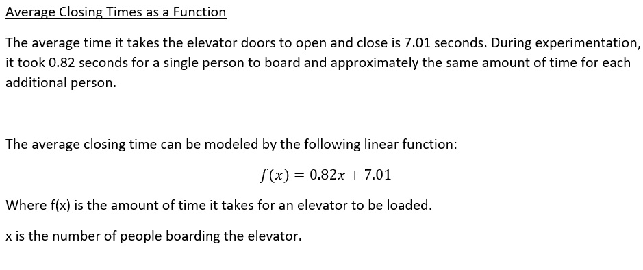
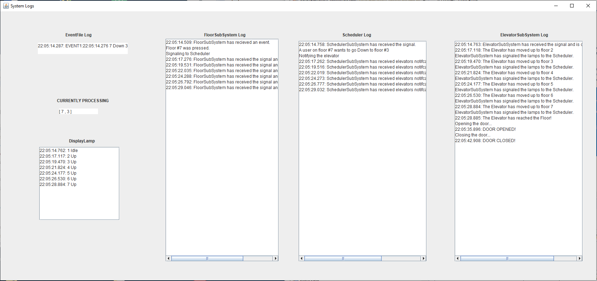
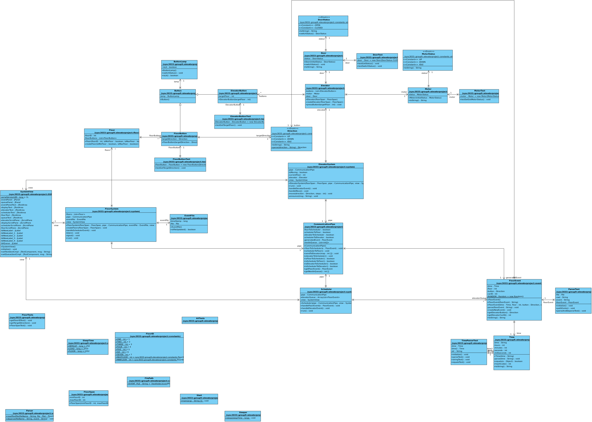
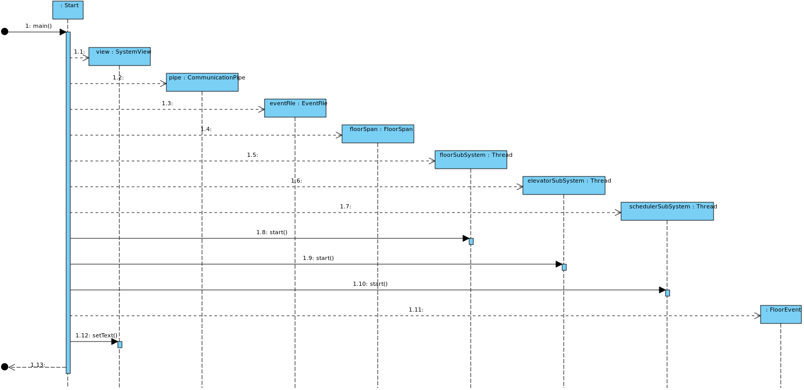

# Elevator System 

Authors: Oluwafunbi Aboderin, Mohammad Gaffori, Kelly Harrison, Julian Mendoza, Giuseppe Papalia

**Installation**

Using folder iteration1.zip

Extract the file!

a. Using Eclipse

	1. Use Eclipse to import a new Project File -> Import -> General -> Projects from Folder or Archive
	2. Click Next
	2. Next to "Import source" click Directory... and locate the folder "iteration1" 
	3. Select the "iteration1" folder
	4. Click finish
	5. Find Start.java via the path iteration1 -> src -> sysc3033.group9.elevatorproject.main
	6. Right-click Start.java and run as a Java Application
  
  
b. Using Command Line (Using lab computers)

	1. Open command line
	2. Type in "java -jar " in the command line (but don't hit enter yet)
	3. Click and drag iteration1.jar into the command line
	4. Hit enter
  
**NOTE you can double click the jar to run the GUI. No command line output will appear**

**Visual Paradigm Tutorial for Team**

	1. Go to Code -> instant Reverse -> Java ... -> Add source folder
	2. Locate the source folder of the Java application Click OK
	3. Go to Class Repository right click on the folder and click reverse "src" to -> New Class Diagram
	4. Select Show Fully Qualified Owner
	5. Next we need to resize the boxes. CTRL + A Right click on a box and find Selection -> Fit Size
	6. Now we need to convert it to a svg and remove watermarks 
	File -> Export -> Active Diagram as Image rename and save.
	7. Open the .svg file in any IDE. CTRL + F and type in Visual. REMOVE ALL TEXT NODES 
	8. Save the file and convert to png using this site: https://svgtopng.com/
	
**Iteration 0**

|

|
|
|---|---|
| 

 |

|

**Iteration 1**

