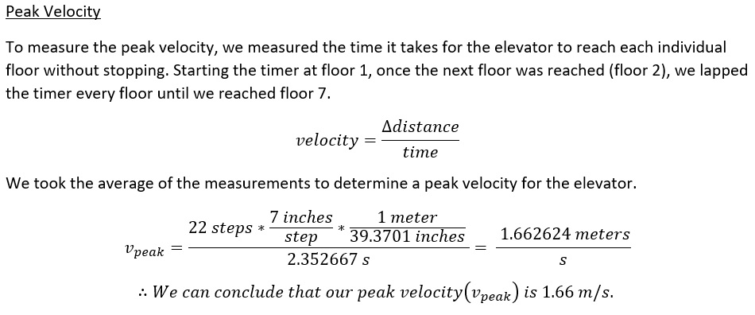
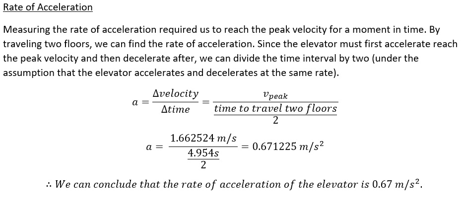
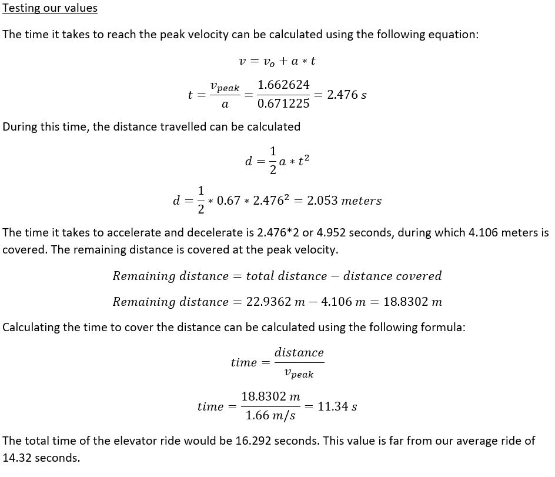
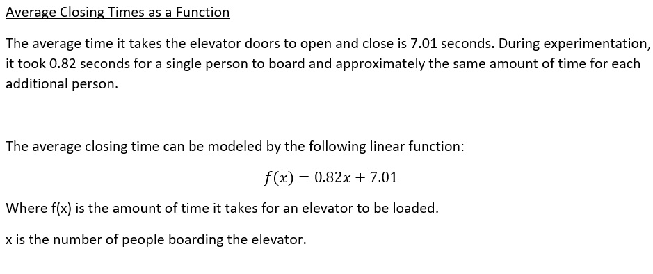

# SYSC 3303 - Elevator System 

Authors: Oluwafunbi Aboderin, Mohammad Gaffori, Kelly Harrison, Julian Mendoza, Giuseppe Papalia

**Installation**

instructions go here

**Iteration 0**

|

|
|
|---|---|
| 

 |

|

**Iteration 1**

diagrams go here
